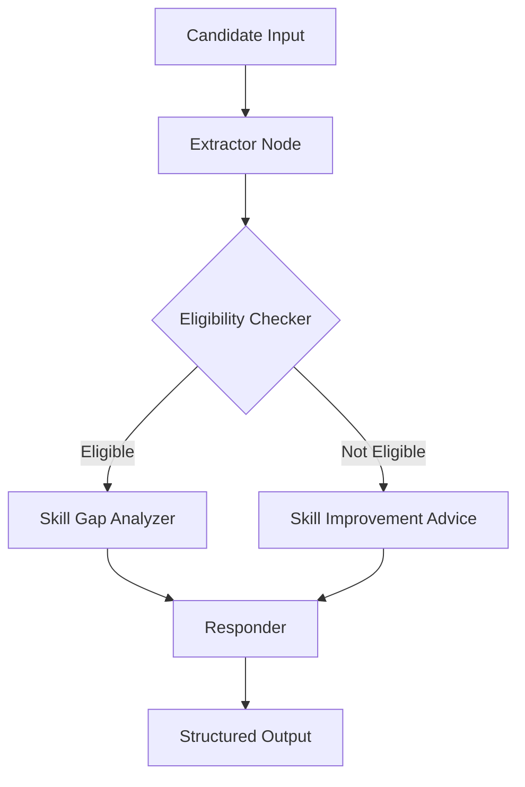

# Internship Eligibility Checker Agent

## 🧠 Use Case

Students often struggle to understand whether they are eligible for internships and what skills they need to improve.
This agent automates the process of evaluating a student's profile and determining internship eligibility while also identifying missing skills required for software engineering roles.

The system analyzes candidate information such as GPA, graduation year, and technical skills, then provides recommendations and skill gap insights.

---

## 🎯 Goal of the Agent

The goal of this agent is to:

* Evaluate whether a student qualifies for a software engineering internship
* Identify missing skills required for industry roles
* Provide structured recommendations to help students improve their chances of selection
* Demonstrate an **agentic workflow using LangGraph and UiPath SDK**

---

## ⚙️ Agent Architecture

The agent is implemented using **LangGraph**, where multiple nodes collaborate to process candidate data.

### Agent Flow

1. **Extractor Node**

   * Extracts candidate details from the input text
   * Parses name, GPA, graduation year, and skills

2. **Eligibility Checker Node**

   * Evaluates if the candidate meets internship requirements
   * Uses rules such as minimum GPA and graduation year

3. **Skill Gap Analyzer Node**

   * Compares candidate skills with required industry skills
   * Identifies missing skills

4. **Responder Node**

   * Generates the final structured response
   * Includes eligibility status, recommendations, and skill gaps

---

## 🔄 Agent Workflow



---

## 🛠️ Technologies Used

* **Python**
* **LangGraph**
* **UiPath Python SDK**
* **Pydantic Models**
* **Structured Agent State**
* **Flask API (optional deployment)**

---

## 📦 Project Structure

```
internship_checker/

agent.mermaid
graph.py
main.py
models.py
nodes.py
state.py
pyproject.toml
README.md
```

---

## 🧠 Agent State Design

The agent uses a structured state object:

```python
class AgentState(TypedDict):
    candidate_input: str
    candidate: Optional[CandidateDetails]
    result: Optional[EligibilityResult]
    skill_gap: Optional[List[str]]
```

This state enables nodes to pass structured data through the LangGraph workflow.

---

## 🧪 Example Input

```
Adithya M, 3rd year CSE, GPA 8.5/10, grad 2026, Python React SQL
```

---

## 📤 Example Output

```json
{
  "candidate_name": "Adithya M",
  "eligible": true,
  "reasons": [
    "Candidate meets requirements"
  ],
  "suggested_role": "Software Engineering Intern",
  "skill_gap": [
    "Data Structures",
    "Algorithms",
    "Git",
    "System Design"
  ]
}
```

---

## 🚀 Key Agentic Features

This project demonstrates:

✔ Multi-node LangGraph orchestration
✔ Structured agent state
✔ Autonomous decision-making
✔ Skill gap analysis logic
✔ Real-world internship evaluation workflow
✔ Structured JSON output

---

## 💡 Real World Impact

This agent can help:

* Students preparing for placements
* Universities screening internship applicants
* Career counseling systems
* Placement preparation platforms

By automatically analyzing student profiles and identifying skill gaps, it helps students understand what they need to learn next.

---

## 🔮 Future Improvements

Possible enhancements include:

* Resume parsing using NLP
* Integration with job description datasets
* Personalized learning recommendations
* Interview preparation suggestions
* Integration with UiPath automation workflows

---

## 👨‍💻 Author

**Adithya M**

Student – Computer Science Engineering
Mahendra Engineering College

---

## 📅 Challenge

Submission for **UiPath Coded Agent Challenge**.
