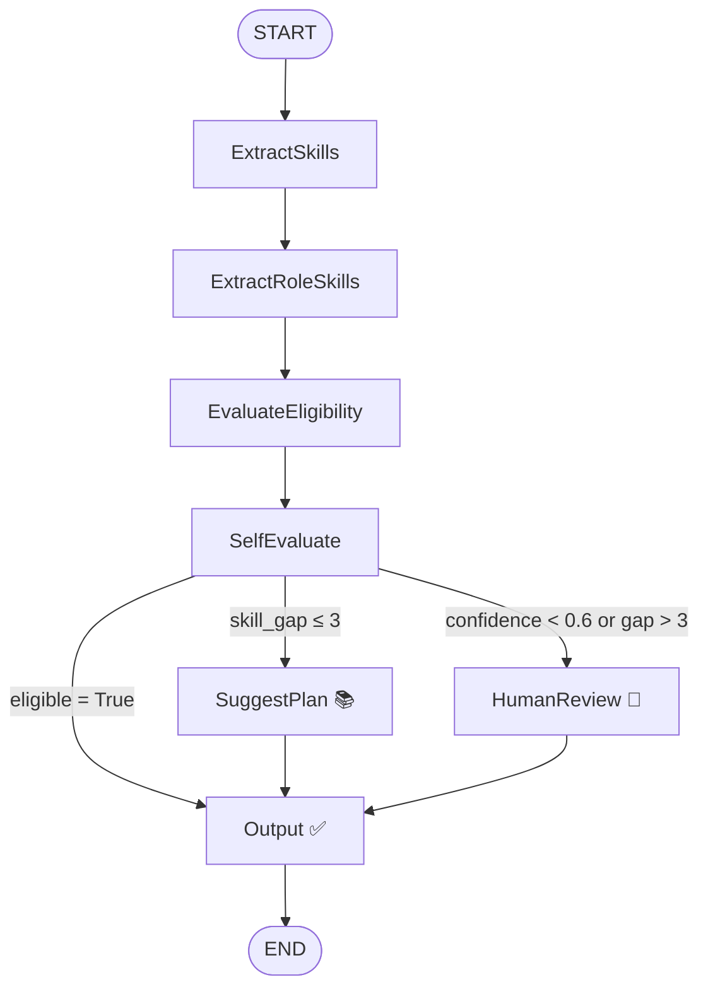

# 🎯 Internship Eligibility Reviewer — Coded Agent

> A LangGraph-powered agentic system that evaluates student profiles against internship role requirements, identifies skill gaps, generates personalised improvement plans, and escalates borderline cases to a human reviewer — deployed via the UiPath Python SDK.

---

## 🧠 Use Case Description

Placement coordinators and recruiters receive hundreds of internship applications and manually reviewing each student's profile against a role's required skills is slow and inconsistent.

This agent automates the full eligibility review pipeline:
- Takes a **student profile** (background, projects, skills) as input
- Takes an **internship role description** (required skills, expectations) as input
- Uses GPT-4o to extract skills from both
- Evaluates the skill gap, self-checks its own confidence, and routes to the right outcome
- Either approves the student, generates a learning plan, or sends the case to a human reviewer via UiPath Action Center

---

## 🎯 Goal of the Agent

To autonomously determine whether a student is eligible for a given internship by:

1. Extracting skills from unstructured free-text using an LLM
2. Identifying the required skills for the role using an LLM
3. Computing the skill gap and an initial confidence score
4. **Self-evaluating** — the LLM re-checks whether its own decision is reasonable
5. **Conditionally routing** to one of three outcomes based on eligibility and confidence
6. Returning a structured JSON output with full details

---

## 🔄 Agent Flow Explanation

```
START
  │
  ▼
ExtractSkills         →  LLM extracts technical skills from the student profile
  │
  ▼
ExtractRoleSkills     →  LLM identifies required skills for the internship role
  │
  ▼
EvaluateEligibility   →  Computes skill gap, eligible flag, and confidence score
                         eligible = True if len(skill_gap) <= 2
                         confidence = max(0.5, 1 - len(gap) * 0.15)
  │
  ▼
SelfEvaluate          →  LLM re-evaluates whether the eligibility decision is reasonable
                         Updates evaluation_confidence
  │
  ▼
[Conditional Routing via routing_decision()]
  ├─── confidence < 0.6                →  HumanReview 👤
  ├─── eligible = True                 →  Output ✅
  ├─── len(skill_gap) <= 3             →  SuggestPlan 📚
  └─── len(skill_gap) > 3              →  HumanReview 👤
         │                   │
         ▼                   ▼
     SuggestPlan         HumanReview
   (LLM generates       (UiPath interrupt +
    learning plan)       CreateTask sent to
         │                Action Center)
         └──────┬──────────────┘
                ▼
             Output  →  Prints structured JSON result
                │
               END
```

### Routing Logic (from `routing_decision()`)

| Condition | Route |
|---|---|
| `evaluation_confidence < 0.6` | `HumanReview` |
| `eligible == True` | Direct to `Output` |
| `len(skill_gap) <= 3` | `SuggestPlan` → `Output` |
| `len(skill_gap) > 3` | `HumanReview` → `Output` |

---

## 🛠️ Tools Used

| Tool | Purpose |
|---|---|
| **UiPath Python SDK** | Agent deployment and integration |
| **LangGraph** | Agent orchestration, `StateGraph`, conditional edges |
| **LangChain Core** | `HumanMessage` for LLM prompting |
| **UiPathAzureChatOpenAI (GPT-4o)** | Skill extraction, eligibility evaluation, plan generation |
| **UiPath `CreateTask` + `interrupt()`** | Human-in-the-loop via Action Center |
| **Pydantic `BaseModel`** | Structured `GraphState` definition |

---

## 🧪 Example Input

**`student_profile`:**
```
Final year B.Tech student in Computer Science. Completed projects in Python-based
data analysis and built a movie recommendation system using collaborative filtering.
Familiar with pandas, numpy, and scikit-learn. Has done an online course in SQL
and basic statistics.
```

**`internship_role`:**
```
Data Science Intern — requires Python, Machine Learning, SQL, Statistics,
data visualisation, and experience with pandas or similar libraries.
```

---

## 📤 Example Output

**Eligible candidate:**
```json
{
  "eligible": true,
  "student_skills": ["Python", "data analysis", "pandas", "numpy", "scikit-learn", "SQL", "statistics"],
  "required_skills": ["Python", "Machine Learning", "SQL", "Statistics", "data visualisation", "pandas"],
  "skill_gap": ["data visualisation"],
  "improvement_plan": null,
  "confidence": 0.85
}
```

**Not eligible — learning plan generated (`skill_gap <= 3`):**
```json
{
  "eligible": false,
  "student_skills": ["Python", "HTML", "CSS"],
  "required_skills": ["Python", "Machine Learning", "SQL", "Statistics", "data visualisation"],
  "skill_gap": ["Machine Learning", "SQL", "Statistics"],
  "improvement_plan": "1. Complete an ML course (Coursera - Andrew Ng, 4 weeks)\n2. Learn SQL via SQLZoo (1 week)\n3. Study Statistics fundamentals via Khan Academy (2 weeks)",
  "confidence": 0.7
}
```

**Escalated to human reviewer (`confidence < 0.6` or `skill_gap > 3`):**
```
→ UiPath Action Center task created:
    Title:            "Review Internship Eligibility"
    Student Profile:  [full profile text]
    Role:             [role description]
    Detected Skills:  Python, HTML, CSS
    Skill Gap:        Machine Learning, SQL, Statistics, data visualisation, pandas

→ Human decision received → eligible flag updated → Output
```

---

## 🧪 Test Input Files

Three ready-to-use input files are included for testing:

| File | Scenario |
|---|---|
| `input_eligible.json` | Student with sufficient skills — routes to Output directly |
| `input_skill_gap.json` | Student with small skill gap — routes to SuggestPlan |
| `input_human_review.json` | Low confidence or large gap — escalates to Human Review |

---

## 🗂️ Project Structure

```
aroosa_hoda/
├── main.py                  # LangGraph agent — full pipeline
├── langgraph.json           # LangGraph configuration
├── pyproject.toml           # Python project dependencies
├── uipath.json              # UiPath SDK deployment config
├── bindings.json            # UiPath argument bindings
├── entry-points.json        # UiPath entry point config
├── agent.mermaid            # Mermaid flow diagram
├── input_eligible.json      # Example input — eligible candidate
├── input_skill_gap.json     # Example input — skill gap case
├── input_human_review.json  # Example input — human review case
└── README.md                # This file
```

---

## 🔁 Mermaid Flow Diagram



---

## ✅ Agentic Design Checklist

- [x] Uses **LangGraph** — `StateGraph` with `add_node`, `add_edge`, `add_conditional_edges`
- [x] Defines a structured **`GraphState`** using Pydantic `BaseModel` with 8 fields
- [x] Includes **7 nodes** — `ExtractSkills`, `ExtractRoleSkills`, `EvaluateEligibility`, `SelfEvaluate`, `SuggestPlan`, `HumanReview`, `Output`
- [x] Includes **conditional routing** via `routing_decision()` with 3 possible routes
- [x] Includes a **self-evaluation step** — LLM re-checks its own confidence score
- [x] Includes **human-in-the-loop** — `interrupt()` + `CreateTask` sends to UiPath Action Center
- [x] Deployed via **UiPath Python SDK**
- [x] Returns **structured JSON output** via `generate_output()`

---

## 👩‍💻 Author

**Aroosa Hoda**
Submission for UiPath Coded Agent Challenge 2026