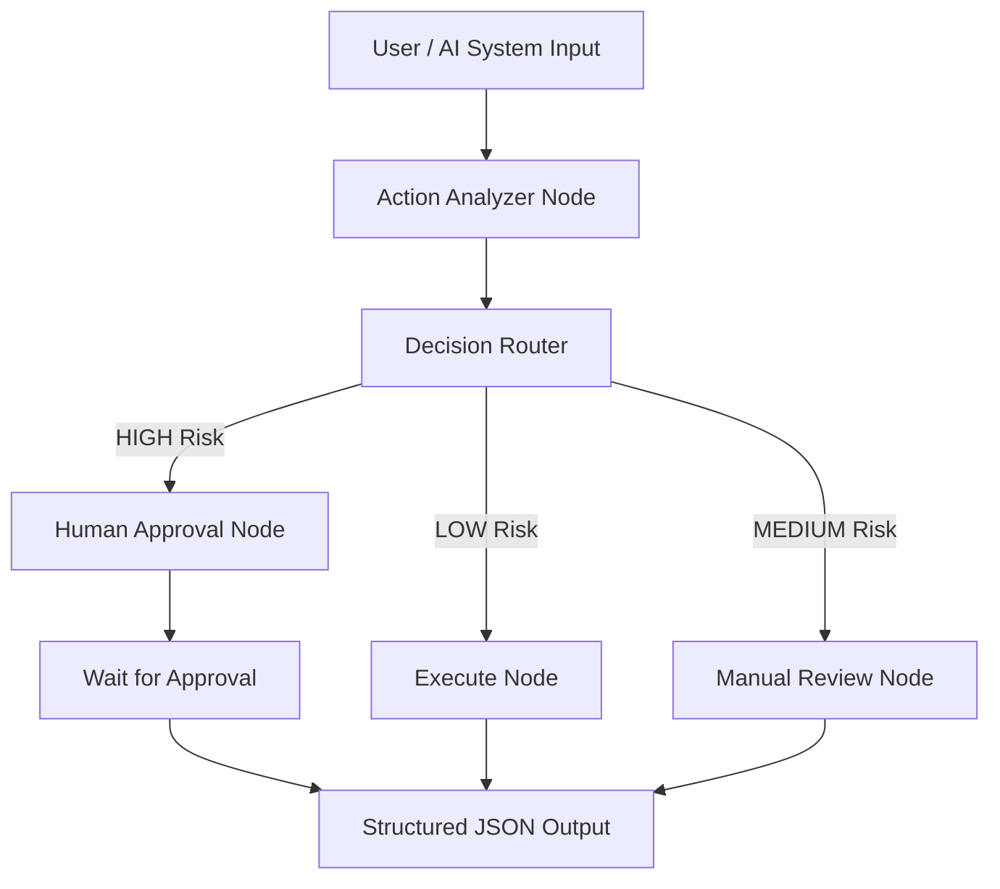
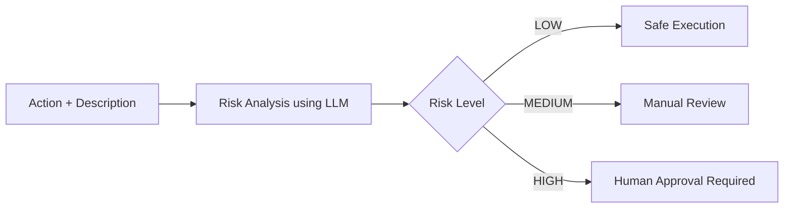
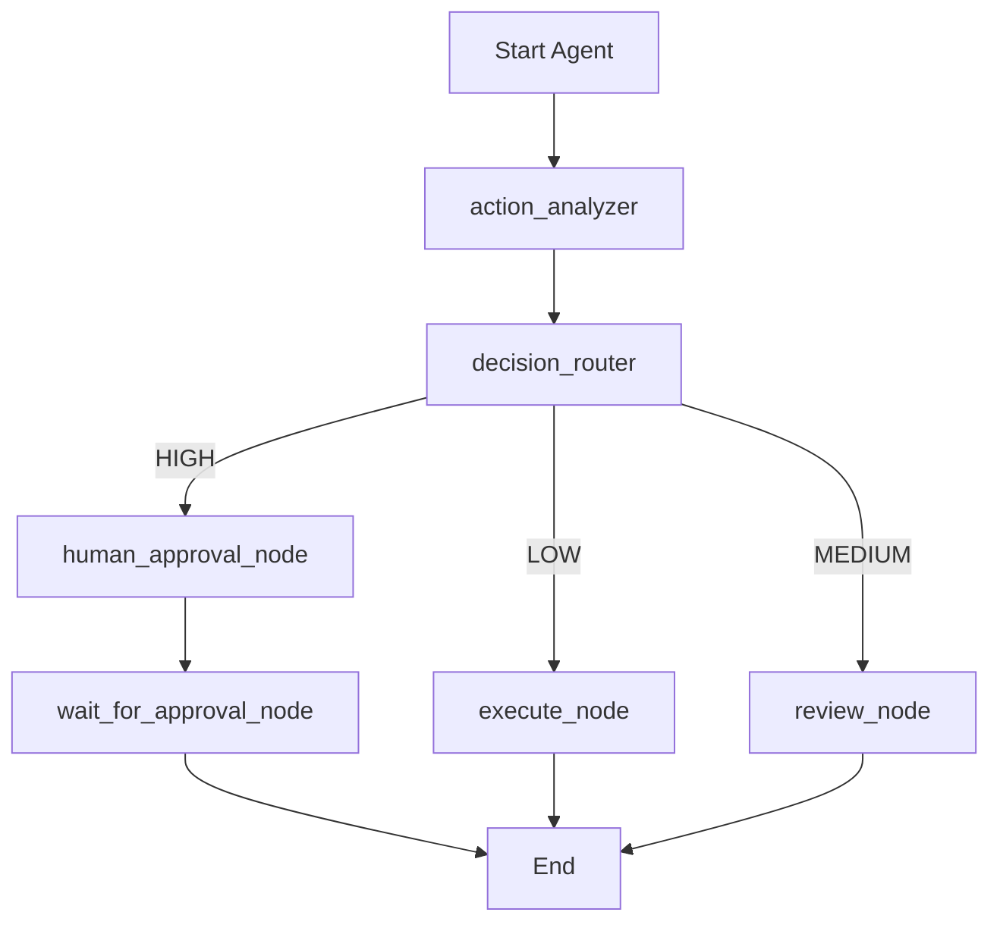
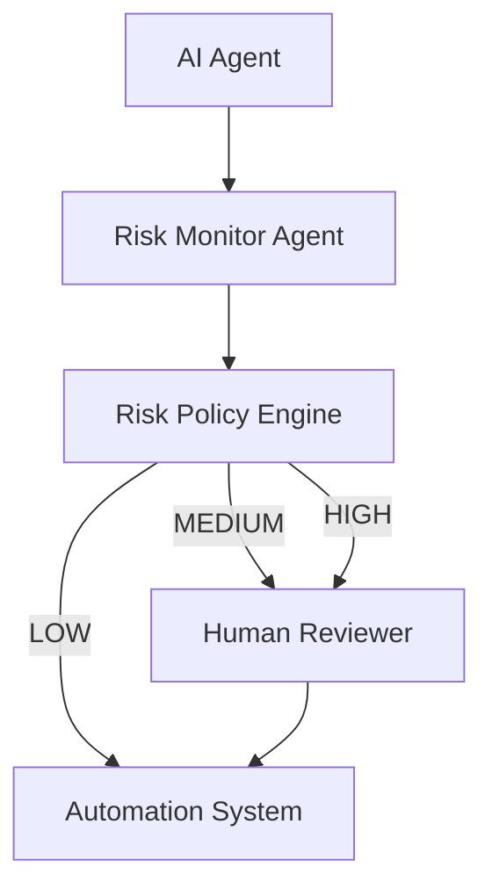
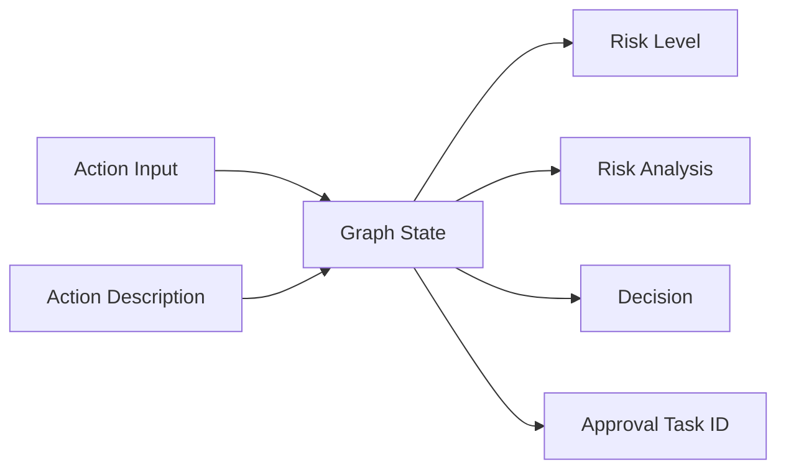

# AI_AGENT_RISK_MONITOR

## Overview

AI_AGENT_RISK_MONITOR is an intelligent agent built using **UiPath Python SDK** and **LangGraph** that evaluates actions proposed by AI systems and classifies their **risk level** before allowing automation to proceed.

In modern AI-driven automation environments, agents may perform actions like sending emails, modifying files, transferring money, or accessing databases. This system acts as a **safety layer**, ensuring that potentially dangerous operations are reviewed before execution.

The agent performs **risk analysis**, routes decisions using **conditional logic**, and integrates **Human-in-the-Loop (HITL)** approval for high-risk actions.

---

# Use Case

AI systems increasingly automate tasks such as:

* Sending Emails
* Deleting Files
* Accessing Databases
* Transferring Money
* Creating Meetings
* Modifying System Settings

These actions may introduce **security risks or unintended consequences**.

The AI Agent Risk Monitor evaluates each action and assigns a **risk level** before execution.

---

# Goal of the Agent

The goal is to ensure safe automation by categorizing actions into three levels:

| Risk Level | Decision                  |
| ---------- | ------------------------- |
| LOW        | Safe to Execute           |
| MEDIUM     | Manual Review Recommended |
| HIGH       | Human Approval Required   |

This allows organizations to **prevent dangerous automation actions** before they occur.

---

# System Architecture



---

# Agent Decision Flow



---

# LangGraph Workflow Diagram



---

# High Level AI Safety Architecture



---

# Agent State Flow



---

# Agent Workflow

### Step 1 – Action Analyzer

Analyzes the action and description using an LLM and produces structured output including:

* risk level
* explanation

### Step 2 – Decision Router

Routes the workflow based on the identified risk level.

### Step 3 – Execute Node

Automatically executes actions classified as **LOW risk**.

### Step 4 – Review Node

Flags actions classified as **MEDIUM risk** for manual review.

### Step 5 – Human Approval Node

Actions classified as **HIGH risk** require **Human-in-the-Loop approval** before execution.

### Step 6 – Wait for Approval

If HITL is not configured, the agent generates a **local placeholder approval task** to allow safe execution during development.

---

# Graph State

The LangGraph state contains the following fields:

* `action`
* `description`
* `risk_level`
* `analysis`
* `decision`
* `task_id`

---

# Example Input

```json
{
  "action": "Transfer Money",
  "description": "Transfer $5000 to external bank account"
}
```

---

# Example Output

```json
{
  "action": "Transfer Money",
  "risk_level": "HIGH",
  "analysis": "Financial transfer to an external or uncontrolled destination detected.",
  "decision": "Human Approval Requested",
  "task_id": "LOCAL-HITL-21125220"
}
```

---

# Technologies Used

* Python
* UiPath Python SDK
* LangGraph
* LangChain
* Pydantic
* JSON structured output

---

# Project Structure

```
submissions/
   manikandan_ai_risk_monitor/
       main.py
       langgraph.json
       pyproject.toml
       uipath.json
       agent.mermaid
       README.md
       bindings.json
       entry-points.json
       input.json
       requirements.txt
       AGENTS.md
       CLAUDE.md
```

---

# Installation

Clone the repository:

```
git clone https://github.com/rajneeshk94/coded-agents-challenge.git
```

Navigate to the project folder:

```
cd submissions/manikandan_ai_risk_monitor
```

Install dependencies:

```
pip install -r requirements.txt
```

---

# Running the Agent

Run the agent using UiPath CLI:

```
uipath run agent --file input.json
```

Example:

```
uipath run agent '{"action":"Send Email","description":"Send report to manager"}'
```

---

# Deployment

To deploy using UiPath CLI:

```
uipath auth
uipath init
uipath pack
uipath publish
```

This will package and deploy the coded agent to UiPath Cloud.

---

# Key Features

* Agentic workflow using **LangGraph**
* Conditional routing based on **risk classification**
* Structured JSON output
* Human-in-the-Loop integration
* Safe fallback when HITL is unavailable
* Modular graph architecture

---

# Future Improvements

* Real-time approval dashboard
* Integration with enterprise security policies
* Risk scoring using historical behavior
* Advanced anomaly detection for AI agents

---

# Conclusion

AI_AGENT_RISK_MONITOR demonstrates a **production-ready agentic safety layer** for AI automation systems.

By combining **LangGraph orchestration**, **structured outputs**, and **human-in-the-loop verification**, the system ensures that automation remains **safe, transparent, and controllable**.

This project showcases how agentic workflows can be used to build **trustworthy AI-driven automation systems**.
