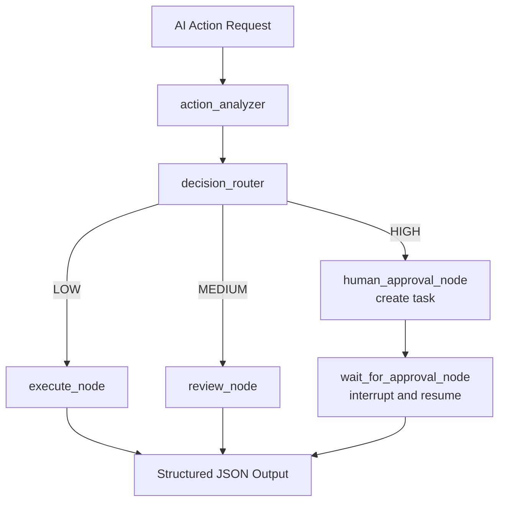
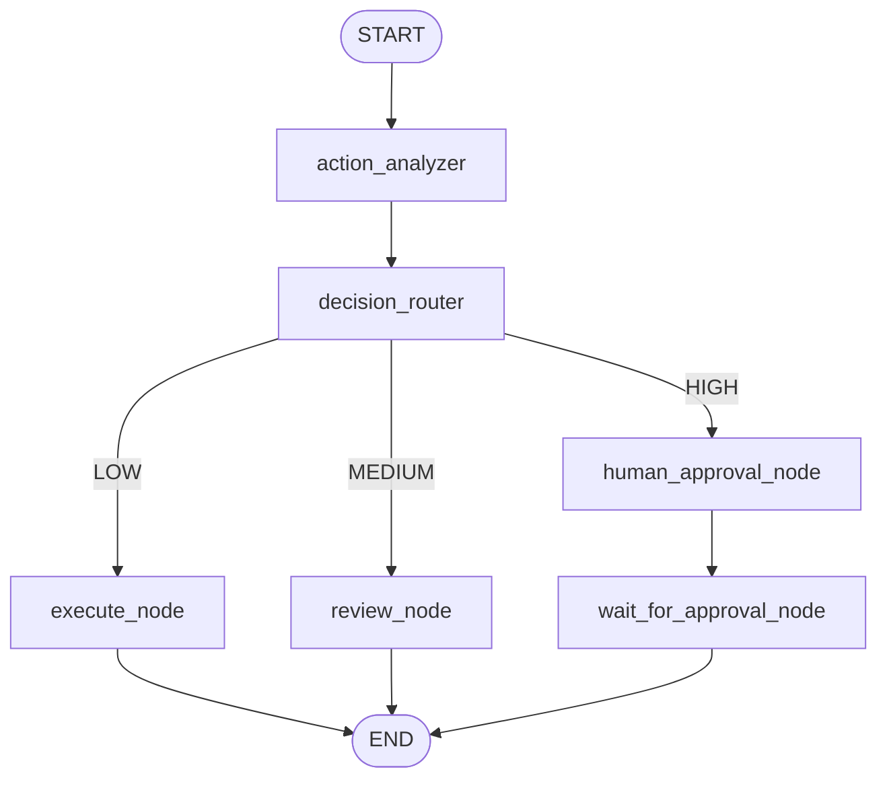

# AI_AGENT_RISK_MONITOR

## Use Case

`AI_AGENT_RISK_MONITOR` monitors actions proposed or executed by AI systems and classifies them as `LOW`, `MEDIUM`, or `HIGH` risk before downstream automation proceeds.

Typical actions:

- Send Email
- Delete File
- Transfer Money
- Access Database
- Create Meeting
- Modify System Settings

## Goal

The agent provides a structured, production-ready risk decision for AI-initiated actions:

- `LOW` -> `Safe to Execute`
- `MEDIUM` -> `Manual Review Recommended`
- `HIGH` -> `Human Approval Requested`

## Graph State

The LangGraph state is implemented as a structured `TypedDict`:

```python
class AgentState(TypedDict):
    action: str
    description: str
    risk_level: str
    analysis: str
    decision: str
    task_id: str
```

## Agent Flow

1. `action_analyzer`
   Uses `UiPathChat` structured output when available and falls back to deterministic heuristics when credentials are missing.
2. `decision_router`
   Routes actions by `risk_level`.
3. `execute_node`
   Returns `Safe to Execute` for `LOW` risk.
4. `review_node`
   Returns `Manual Review Recommended` for `MEDIUM` risk.
5. `human_approval_node`
   Creates the UiPath Action Center task for `HIGH` risk actions.
6. `wait_for_approval_node`
   Pauses the graph with `WaitEscalation(...)` until a human approves or rejects the task.

## Human-In-The-Loop Integration

High-risk actions are escalated to UiPath HITL services using the installed UiPath SDK:

- `UiPath().tasks.create_async(...)` creates the Action Center task.
- `interrupt(WaitEscalation(...))` pauses execution until the human task is completed.
- The graph resumes and returns the reviewed outcome.

Implementation note:

- The high-risk path is intentionally split into task creation and wait/resume nodes so task creation happens exactly once across suspend and resume cycles.
- When UiPath HITL is not configured locally, the agent returns a local placeholder `task_id` so `uipath run agent ...` still works during development.

Required environment variables for real UiPath HITL:

```bash
UIPATH_HITL_APP_NAME=AI Action Approval App
UIPATH_HITL_APP_FOLDER_PATH=Shared
UIPATH_HITL_RECIPIENT_EMAIL=approver@company.com
UIPATH_HITL_PRIORITY=High
```

## Tools Used

- Python
- UiPath Python SDK
- `uipath-langchain`
- LangGraph
- LangChain
- Typed `AgentState`
- Conditional routing
- UiPath Action Center HITL

## Architecture Diagram



## Workflow Diagram



## Architecture Explanation

The project uses:

- `Input` for UiPath runtime input schema
- `AgentState` as the structured LangGraph state
- `Output` for the final JSON contract
- conditional routing from `decision_router`
- a dedicated HITL creation node and a resumable approval wait node

This design keeps task creation idempotent and allows production deployments to pause and resume safely when a human must review high-risk actions.

## Example Input

```json
{
  "action": "Transfer Money",
  "description": "Transfer $5000 to external bank account"
}
```

## Example Output

Local development output when HITL is not configured:

```json
{
  "action": "Transfer Money",
  "risk_level": "HIGH",
  "analysis": "Financial transfer to an external or uncontrolled destination detected. UiPath HITL is not configured in the current environment; returned a local approval placeholder instead.",
  "decision": "Human Approval Requested",
  "task_id": "LOCAL-HITL-1234ABCD"
}
```

Production runtime behavior when HITL is configured:

1. The first run creates a UiPath Action Center task and pauses.
2. After the human completes the task, resume the run.
3. The final response includes the `task_id` and the human-reviewed decision.

## How to Run

Install dependencies:

```bash
pip install uipath-langchain langgraph langchain
```

Optional project bootstrap command from the challenge instructions:

```bash
uipath new ai-agent-risk-monitor
```

Initialize the project metadata:

```bash
uipath init
```

Run locally with inline JSON:

```bash
uipath run agent '{"action":"Transfer Money","description":"Transfer $5000"}'
```

Run locally with a JSON file:

```bash
uipath run agent --file high_input.json --output-file high_output.json
```

Resume a suspended HITL run after a human completes the task:

```bash
uipath run --resume
```

## How to Deploy Using UiPath CLI

1. Authenticate:

```bash
uipath auth
```

2. Initialize runtime metadata and schemas:

```bash
uipath init
```

3. Pack the project:

```bash
uipath pack
```

4. Publish the package:

```bash
uipath publish
```

5. Deploy to a UiPath tenant where Orchestrator and Action Center are enabled.

## Files

- `main.py` - LangGraph agent with UiPath HITL integration
- `langgraph.json` - UiPath LangGraph entrypoint mapping
- `uipath.json` - UiPath runtime and packaging configuration
- `pyproject.toml` - Python package metadata and dependencies
- `agent.mermaid` - workflow diagram
- `README.md` - setup, architecture, and deployment guide
