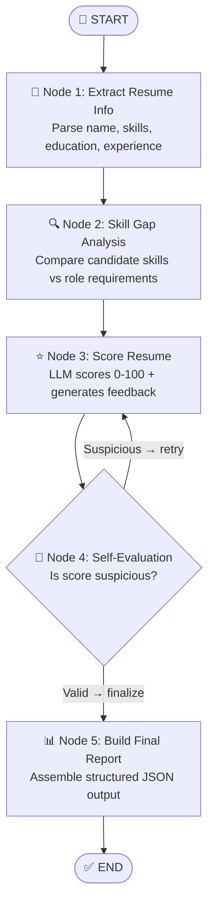

# 📝 Resume Reviewer Agent

> **UiPath Coded Agent Challenge Submission**
> Built with LangGraph + UiPath Python SDK

---

## 🧠 Use Case Description

Campus placement season is intense — recruiters review hundreds of resumes for limited spots. This agent automates the initial resume screening process by parsing, analyzing skill gaps, scoring, and generating structured feedback — all autonomously, without human intervention per resume.

---

## 🎯 Goal of the Agent

Given a resume (plain text) and a target role, the agent:

1. **Parses** the resume into structured sections
2. **Identifies skill gaps** against the target role's requirements
3. **Scores** the candidate (0–100) with LLM reasoning
4. **Self-evaluates** the score for quality and retries if suspicious
5. **Returns** a structured JSON report with recommendation

---

## 🔄 Agent Flow Explanation



### Nodes

| Node | Role | Type |
|------|------|------|
| `extract` | Parses resume into structured JSON | LLM call |
| `skill_gap` | Compares skills to role requirements | Logic |
| `score` | LLM evaluates and scores the resume | LLM call |
| `self_eval` | Validates output quality | Self-evaluation |
| `report` | Builds the final structured report | Assembly |

### Agentic Behaviors ✅

- **Conditional Routing** — `self_eval` node routes back to `score` if result looks wrong
- **Retry Mechanism** — Up to 2 retries if score is suspicious (e.g. edge cases like 0 or 100)
- **Self-Evaluation Step** — Agent checks its own output quality before finalizing
- **Tool Selection Logic** — Falls back between UiPath LLM Gateway and direct Anthropic API

---

## 🛠️ Tools Used

| Tool | Purpose |
|------|---------|
| **UiPath Python SDK** (`uipath-langchain`) | Deployment, LLM Gateway, cloud invocation |
| **LangGraph** | Agent orchestration and state machine |
| **LangChain Core** | Message handling |
| **Claude (via UiPath LLM Gateway)** | Resume parsing, scoring, feedback |

---

## 🧪 Example Input

```json
{
  "resume_text": "John Doe | john.doe@email.com\n\nEDUCATION\nB.Tech Computer Science, IIT Delhi (2021-2025) | CGPA: 8.4/10\n\nSKILLS\nPython, JavaScript, React, SQL, Git, Docker\n\nPROJECTS\n- E-Commerce Platform: Built full-stack app with 500+ users\n- ML Price Predictor: 92% accuracy on housing data\n\nEXPERIENCE\nSoftware Intern, TechCorp (May 2024 - Jul 2024)\n- Developed REST APIs reducing response time by 30%\n\nCERTIFICATIONS\nAWS Cloud Practitioner",
  "target_role": "Software Engineer"
}
```

---

## 📤 Example Output

```json
{
  "candidate_name": "John Doe",
  "target_role": "Software Engineer",
  "overall_score": 78,
  "recommendation": "Strong Hire",
  "feedback": "John demonstrates solid full-stack skills with practical project experience. His internship shows real-world impact. Recommend strengthening System Design knowledge before final interview rounds.",
  "skill_gaps": ["Data Structures", "System Design"],
  "profile_summary": "Final-year CS student with strong Python and web dev skills and one internship.",
  "education": "B.Tech Computer Science, IIT Delhi",
  "experience_years": 0,
  "top_skills": ["Python", "JavaScript", "React", "SQL", "Git", "Docker"],
  "status": "completed"
}
```

---

## 🚀 Setup & Run

### 1. Install dependencies

```bash
# Using uv (recommended)
uv init . --python 3.11
uv venv && source .venv/bin/activate
uv add uipath-langchain

# OR using pip
pip install uipath-langchain
```

### 2. Authenticate with UiPath

```bash
uipath auth
uipath init
```

### 3. Run locally

```bash
uipath run agent '{"resume_text": "Your resume here...", "target_role": "Software Engineer"}'
```

Or use a file:
```bash
# Create input.json with your resume data
uipath run agent --file input.json
```

### 4. Deploy to UiPath Cloud

```bash
uipath pack
uipath publish --my-workspace
uipath invoke agent --file input.json
```

---

## 📦 File Structure

```
resume_reviewer_agent/
├── main.py           # LangGraph agent (nodes, state, graph)
├── langgraph.json    # LangGraph config
├── pyproject.toml    # Project metadata & dependencies
├── uipath.json       # Entry points schema
├── agent.mermaid     # Visual flow diagram
├── .env              # Environment variables (not published)
└── README.md         # This file
```

---

## 🏗️ Architecture Highlights

- **`ResumeState` TypedDict** — Strongly typed state flows through all nodes
- **`add_messages` annotation** — Tracks LLM conversation history
- **`should_retry_scoring()`** — Conditional router for self-healing behavior
- **Graceful JSON parsing** — Strips markdown fences, handles malformed LLM output
- **Role-based skill requirements** — Built-in for 5 common roles, extensible
