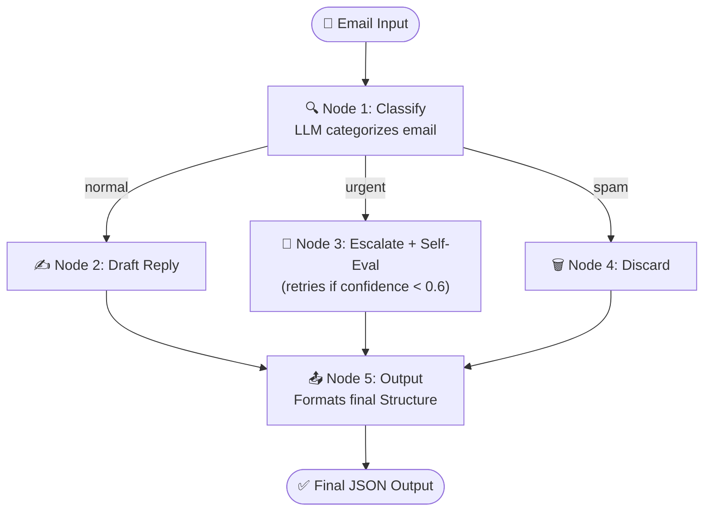

# 📧 Smart Email Triage & Draft Agent

> An autonomous LangGraph agent that reads incoming emails, classifies them, and takes the right action — draft a reply, escalate urgently, or silently discard spam.

---

## 🧠 Use Case Description

Email overload costs businesses billions in lost productivity. This agent acts as an intelligent first-responder for any email inbox. It autonomously decides:
- Is this email **urgent** (angry customer, legal issue, system down)?
- Is it **normal** business correspondence needing a polite reply?
- Or is it **spam** that should be silently discarded?

Then it **acts** — drafts a reply or escalates to a human manager — without any manual intervention.

**Real-world value:** Saves 30–60 minutes per employee per day on email triaging.

---

## 🎯 Goal of the Agent

Given a raw email (subject, body, sender), the agent must:
1. Classify the email into a category
2. Route to the appropriate action path
3. Generate a professional draft reply (if needed)
4. Self-evaluate quality and retry if confidence is low
5. Return a fully structured JSON output

---

## 🔄 Agent Flow Explanation

```
Email Input (subject, body, sender)
       │
       ▼
┌─────────────────────┐
│  Node 1: Classify   │  ← LLM decides: urgent / normal / spam
└─────────────────────┘
       │
  ─────┼──────────────────────────
  │              │               │
urgent         normal          spam
  │              │               │
  ▼              ▼               ▼
┌──────────┐ ┌───────────┐ ┌─────────┐
│ Escalate │ │Draft Reply│ │ Discard │
│  Node 3  │ │  Node 2   │ │ Node 4  │
└──────────┘ └───────────┘ └─────────┘
  │ (self-eval loop if conf < 0.6)
  ▼
┌─────────────────────────────────┐
│        Node 5: Output           │
└─────────────────────────────────┘
  ▼
Structured JSON Output
```

### Agentic Behaviors Demonstrated:
| Behavior | Where |
|---|---|
| ✅ Conditional Routing | `route_by_category()` routes to 3 different nodes |
| ✅ Self-Evaluation | Escalate node checks `confidence_score` and retries |
| ✅ Retry Mechanism | Up to 2 retries if LLM confidence < 0.6 |
| ✅ Strict UiPath Coded Agent State | Utilizing `Input`, `State`, and `Output` specific standard models (Pydantic) |
| ✅ Proper Graph Conclusion | Explicit `output_node` passing state values to output models |

---

## 🛠️ Tools Used

| Tool | Purpose |
|---|---|
| `LangGraph` | Graph orchestration, state management, conditional edges |
| `UiPath LangChain SDK` | Deployment, LLM Gateway, UiPath Cloud integration |
| `UiPathChat` | LLM API initialization directly aligned with normalized UiPath LLMs (using `gpt-4o-2024-08-06`) |
| `Pydantic v2` | Typed state schemas for strictly enforced architecture models (`Input`, `State`, `Output`) |

---

## 🧪 Example Input

We have included a test file `test_input.json`.

```json
{
  "email_subject": "System down!",
  "email_body": "Everything is broken.",
  "sender": "client@company.com"
}
```

---

## 📤 Example Output

(Obtained naturally from a local `uipath run` using the file above.)

```json
{
  "category": "urgent",
  "action": "escalate",
  "draft_reply": "Subject: Immediate Attention Required: System Down\r\n\r\nDear [Name],\r\n\r\nThank you for reaching out...",
  "escalation_note": "The system is down for the client from Rajalakshmi University, and immediate action is required.",
  "confidence_score": 0.95,
  "reasoning": "The subject and body indicate a critical issue with the system being down, requiring immediate attention."
}
```

### Example 2 — Normal Email:

Request:

```json
{
  "email_subject": "Question about your pricing plans",
  "email_body": "Hi, I wanted to know if you offer annual billing discounts for teams of 10+.",
  "sender": "sarah@startup.io"
}
```

Output:

```json
{
  "category": "normal",
  "action": "draft_reply",
  "draft_reply": "Hi Sarah! Thanks for reaching out. Yes, we do offer annual billing discounts for teams — typically 20% off monthly rates for teams of 10 or more. I'd be happy to connect you with our sales team for a custom quote. Would a quick call this week work for you?",
  "escalation_note": "",
  "confidence_score": 0.85,
  "reasoning": "Standard pricing inquiry from a potential customer — no urgency, requires a friendly informational reply."
}
```

### Example 3 — Spam:

Request:

```json
{
  "email_subject": "You've WON a free iPhone 15!!!",
  "email_body": "Click here to claim your prize now! Limited time offer!",
  "sender": "noreply@promo-spam123.xyz"
}
```

Output:

```json
{
  "category": "spam",
  "action": "discard",
  "draft_reply": "",
  "escalation_note": "",
  "confidence_score": 0.95,
  "reasoning": "Classic spam pattern: prize offer, urgency language, suspicious sender domain."
}
```

---

## 🎥 Demo Video

For a quick walkthrough of the agent in action, please view the included video:

<video src="https://github.com/user-attachments/assets/demo.mp4" controls="controls" muted="muted" style="max-height:640px;"></video>
 

---

## 🗺️ Architecture & Flow Diagram

### Architecture
The agent leverages **LangGraph** to process states asynchronously through a defined node graph. It uses **UiPathChat** as the LLM gateway to handle classification and specialized drafting logic, ensuring strict outputs via **Pydantic** models. The entry point runs via the **UiPath CLI**, which interfaces seamlessly with local inputs and JSON schema bindings.



---

## 🏃 How to Run Locally

If you are a reviewer or tester wanting to evaluate the agent on your own machine:

```bash
# 1. Prepare environment and make sure uipath cli is available
# ... (Install UV, activate your venv, run pip install -e .) 

# 2. Authenticate with UiPath Cloud First!
# This connects the agent to the LLM Gateway and requires a browser login
uipath auth

# 3. Generate the Graph Bindings / Update API schemas
uipath init --infer-bindings

# 4. Run the Agent using our built-in test input.
# 'email_triage_agent' is the name of the designated entrypoint in our uipath.json
uipath run email_triage_agent -f test_input.json
```

---

## 📁 Folder Structure

```
nishanth_p/
├── main.py                          # The core LangGraph agent script strictly adhering to REQUIRED_STRUCTURE.md
├── test_input.json                  # Sample data to quickly run the CLI evaluation block
├── pyproject.toml / requirements    # Project dependencies
├── uipath.json / entry-points.json  # UiPath deployment auto-generated configurations
├── *.mermaid                        # Generated flow diagram references outputted by the SDK and design docs
├── output.txt                       # Logs from actual executions locally testing the agent
└── README.md                        # This setup and documentation file
```

