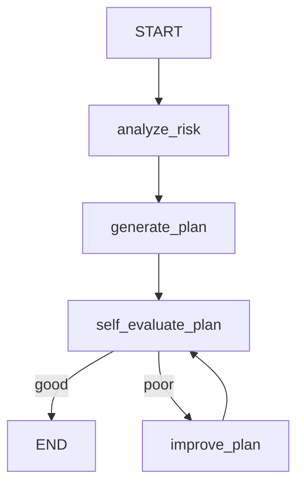

# 📚 Adaptive Study Strategy Agent (Self-Evaluating)

## 🧠 Use Case Description

This agent helps students create adaptive, realistic study strategies based on:

- Subjects
- Exam dates
- Current preparation level
- Daily available study hours
- Weak subjects

Unlike a simple planner, this agent:
- Calculates workload risk
- Generates a structured study plan
- Self-evaluates its own output
- Improves the plan if quality is poor

It demonstrates true agentic behavior using conditional routing and multi-step reasoning.

---

## 🎯 Goal of the Agent

The agent aims to:

✅ Assess academic workload risk
📊 Generate structured study plans
🔁 Critically evaluate plan quality
⚠️ Improve unrealistic or weak plans automatically 
📦 Return structured output

This ensures plans are practical, adaptive, and reliable.

---

## 🔄 Agent Flow Explanation

### Analyze Risk (`analyze_risk`)
- Calculates days remaining until exams
- Computes workload factor
- Determines risk level (low / medium / high)

### Generate Plan (`generate_plan`)
- Uses UiPath LLM Gateway (GPT-4o-mini)
- Creates structured study plan
- Allocates time across subjects

### Self Evaluation (`self_evaluate_plan`)
- Agent critiques its own generated plan
- Returns:
  - `good`
  - `poor`

Checks for:
- Unrealistic schedules
- Missing revision strategy
- Vague structure

### Conditional Routing

If plan_quality == "poor":
→ Route to `improve_plan`

Else:
→ End

### Improve Plan (`improve_plan`)
- Refines structure
- Makes schedule more realistic
- Strengthens revision plan

---

## 🔀 Agent Flow Diagram

---

## 🛠️ Tools Used

| Tool | Purpose |
|------|---------|
| LangGraph | State orchestration |
| Pydantic | Typed state management |
| UiPathChat | LLM integration via UiPath LLM Gateway |
| Conditional Edges | Agent decision routing |
| Multi-step reasoning | Plan evaluation + refinement |

---

## 🧪 Example Input
```json
{
"subjects": ["Math", "Physics", "Computer Science"],
"exam_dates": ["2026-03-15", "2026-03-20", "2026-03-25"],
"preparation_level": "low",
"daily_hours": 3,
"weak_subjects": ["Math"]
}
```

---

## 📤 Example Output

```json
{
"risk_level": "high"
"study_plan": "Based on the provided information, here’s a structured weekly study plan that prioritizes your weak subject (Math) while also allocating time to Physics and Computer Science. The plan is designed for a total of 3 hours of study each day, with a focus..."
}
```


If the plan is weak, the agent automatically improves it before returning the final result.

---

## 🧩 Agentic Design Highlights

✔ Multi-step reasoning
✔ Conditional routing
✔ Self-evaluation mechanism
✔ Structured state transitions
✔ Autonomous improvement behavior

This is not a simple Input → LLM → Output system.
It demonstrates autonomous decision-making and adaptive refinement.

---

## 🚀 Deployment

Built using:

- UiPath Python SDK
- LangGraph
- UiPath LLM Gateway

Run locally using:
uipath run agent --file input.json

Publish using:
uipath pack
uipath publish --my-workspace

---
